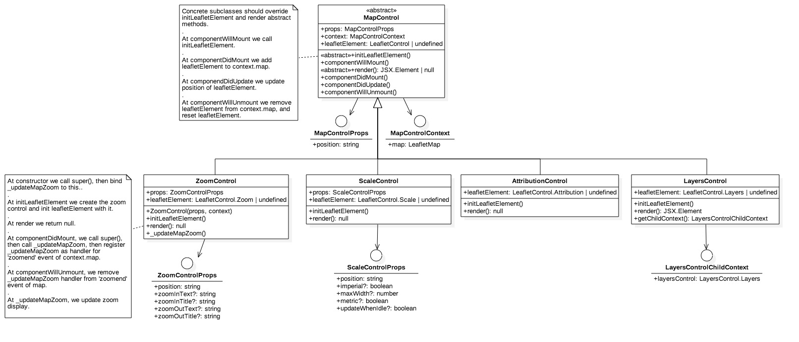

#@yavuzmester/react-leaflet

I converted [react-leaflet](https://github.com/PaulLeCam/react-leaflet). library into Typescript (from Flow), also made some refactoring. 

I do not intend to maintain this package regularly.

###uml diagrams

