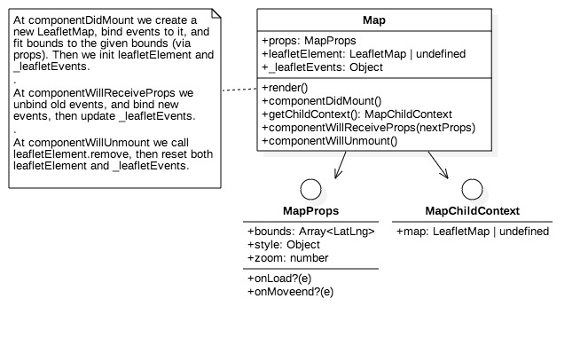

#@yavuzmester/react-leaflet

I converted [react-leaflet](https://github.com/PaulLeCam/react-leaflet). library into Typescript (from Flow), also made some refactoring. 

I provide the codes here so that you can modify it according to your needs, I do not intend to maintain this package regularly.

I also create some uml diagrams which you can look below:

###uml diagrams

